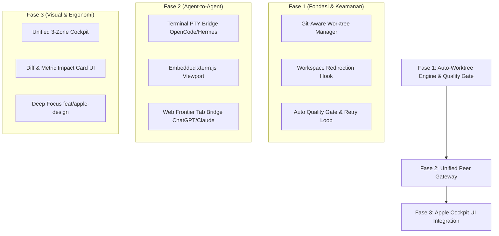

# Master Blueprint: Autonomous Worktree Engine & Unified Peer Gateway

**Status:** Approved via `/grill-me` (2026-09-17)  
**Tujuan:** Menjawab 9 pilar arsitektur Abelink (revisi aman, modularitas, flow konsisten, UI rapi, kemudahan pakai personal, perubahan terukur, ketahanan sistem, auto-worktree dev/prod, dan kolaborasi agent-to-agent via terminal PTY & web frontier).

---

## 1. Fondasi Universal: Git-Aware Auto-Worktree Engine

### Problem Statement
Saat agen AI (Abelink, sub-agent, atau terminal peer) melakukan refaktor atau coding, mutasi langsung pada branch aktif atau folder proyek berisiko merusak state dev/prod, menyebabkan merge collision, atau membuat build gagal di tengah jalan.

### Solusi Teknis
Setiap kali ada agen yang menyentuh kode proyek:
1. **Pendeteksian Otomatis:** Sistem mendeteksi target proyek adalah git repository.
2. **Isolasi Worktree:** Abelink secara otomatis membuat git worktree terisolasi di `.abelink/worktrees/<task-or-agent-id>`.
3. **Workspace Re-pointing:** Tool filesystem agen (`fs_read_file`, `fs_write_file`, `fs_list_dir`, `fs_grep_search`, command runner) diarahkan ke direktori worktree tersebut, bukan root proyek.
4. **Zero Main Pollution:** Branch `main` dan proses dev server utama tidak pernah tersentuh sampai seluruh verifikasi lulus.

### Kebijakan Pembersihan Berkala & Proteksi Disk (Periodic Cleansing Policy)
Untuk mencegah disk bloat dan penumpukan worktree yatim (orphaned worktrees):
1. **TTL & Inactivity Pruning:** Worktree yang idle lebih dari 24 jam tanpa commit baru akan dijadwalkan untuk dipangkas otomatis.
2. **Safe Pruning Gate:** Sebelum penghapusan direktori worktree dilakukan, runner memeriksa status `git status --porcelain`. Jika terdeteksi dirty state (uncommitted changes), pembersihan dibatalkan dan sistem mencatat peringatan ke harness log.
3. **Orphan & Branch Cleanup:** Menjalankan `git worktree prune` secara periodik dan menghapus branch sementara (`abelink/auto-*`) yang sudah berstatus merged ke branch target.
4. **Disk Space Guard:** Memeriksa ketersediaan ruang disk lokal sebelum membuat worktree baru (threshold aman: minimal 2GB free space). Jika kapasitas di bawah batas aman, pembuatan worktree ditolak dengan error eksplisit untuk mencegah OS crash.

---

## 2. Autonomous Worktree Quality Gate

### Siklus Verifikasi & Perubahan Terukur
Saat agen menyelesaikan tugas di worktree:
1. **Lokal Test & Lint Execution:** Runner otomatis menjalankan `bunx vitest run` dan `bun run lint` di dalam worktree tersebut.
2. **Self-Healing Retry Loop:** Bila terjadi kegagalan (test merah / syntax error / lint error), pesan error diumpankan kembali ke agen dengan batas maksimal 3 putaran perbaikan mandiri.
3. **Diff & Metric Impact Card:** Bila seluruh test hijau, sistem menghitung metrik perubahan:
   - Delta unit test (+N passing).
   - Delta latensi perf (via `perf-gate`).
   - Line diff (+insertions, -deletions).
4. **Atomic Fast-Forward / Squash Merge:** Setelah verifikasi lolos, perubahan di-merge ke branch target, dan worktree dibersihkan secara otomatis.

---

## 3. Unified Peer Gateway: Kolaborasi Agent-to-Agent

Abelink bertindak sebagai koordinator utama (Mission Control) yang dapat memimpin dan berdiskusi langsung dengan dua kelas agen eksternal:

### A. Local Terminal Engineers (OpenCode, Hermes)
- **Konektor:** PTY Subprocess Bridge (`src-tauri` / sidecar channel `peer:terminal`).
- **Antarmuka Pengguna:** Panel terminal `xterm.js` tersemat di UI untuk pemantauan real-time atau intervensi langsung oleh user.
- **Intercom Discussion Bus:** Percakapan teknis antara Abelink dan OpenCode/Hermes diparsing dan dirangkum ke dalam kartu diskusi Intercom, sehingga instruksi dan kesepakatan arsitektur tercatat transparan.

### B. Universal Web Frontier Brainstorm Peers (Open Registry)
Tidak terbatas pada satu atau dua provider komersial. Menggunakan arsitektur adapter DOM polimorfik (`WebPeerRegistry`) yang memanfaatkan Browser Extension Abelink:
- **Interface WebPeerAdapter:**
  * `matchUrl(url)`: regex pola URL host web AI.
  * `selectors`: mapping CSS selector untuk elemen krusial:
    - `promptInput`: textarea input prompt pengguna.
    - `sendBtn`: tombol submit / generate.
    - `streamingIndicator`: penanda proses inferensi sedang berlangsung.
    - `responseContainer`: elemen pembungkus pesan balasan model.
    - `stopBtn`: tombol batal / interrupt.
  * `extractContent(element)`: parser markdown / plain text hasil inferensi.
- **Dukungan Provider Bawaan (Out-of-the-Box):**
  * OpenAI ChatGPT (`chatgpt.com`, GPT-5.6 / 4o / o3)
  * Anthropic Claude (`claude.ai`, Sonnet 5 / Claude 3.7 Sonnet)
  * DeepSeek Chat (`chat.deepseek.com`, DeepSeek-R1 / V3)
  * Alibaba Qwen (`chat.qwenlm.ai`, Qwen-2.5-Max / QwQ)
  * Perplexity (`perplexity.ai`, Sonar / Deep Research)
  * xAI Grok (`x.com/i/grok`, Grok-3)
  * Moonshot Kimi (`kimi.moonshot.cn`, Kimi k1.5)
- **Extensible User Registry:** Pengguna dapat mendefinisikan provider web baru via file konfigurasi `~/.config/abelink/web-peers.json` tanpa perlu mengubah kode sumber sidecar.
- **Alur Kerja Brainstorm:**
  1. Abelink memilih peer dari registry (misalnya Claude Sonnet 5 untuk review arsitektur atau Qwen untuk verifikasi matematika/algoritma).
  2. Membuka atau menggunakan tab yang sudah terpasang via browser bridge.
  3. Menyuntikkan prompt diskusi teknis langsung ke DOM input web peer.
  4. Memantau streaming hingga sinyal done terdeteksi, lalu mengekstrak hasil balasan dan merangkumnya ke Intercom Mission Control.

---

## 4. UI/UX: Apple-Style Unified Command Cockpit

*Catatan: Implementasi visual dipisahkan ke sesi deep-focus khusus di worktree `feat/apple-design`.*

### Spesifikasi Layout 3-Zona
- **Zona Kiri:** Chat & Intent (percakapan utama, perintah suara, persona Abelink).
- **Zona Tengah:** Interactive Workspace (live code viewer, worktree diff card, status quality gate).
- **Zona Kanan:** Mission Control & Peer Agents (subagents aktif, terminal peers OpenCode/Hermes, web frontier tabs).
- **Floating Status Dock:** Menampilkan metrik memori, status git worktrees aktif, dan koneksi engine.

---

## 5. Roadmap Implementasi Bertahap

### Urutan Eksekusi:
1. **Fase 1 (Next Up):** Implementasi `sidecar/engine/channels/worktree.mjs` + hooks workspace redirection + quality gate auto-test.
2. **Fase 2:** Implementasi PTY terminal bridge untuk agen lokal dan DOM injector untuk web frontier peers.
3. **Fase 3:** Sinkronisasi dan perakitan antarmuka di worktree `feat/apple-design`.
